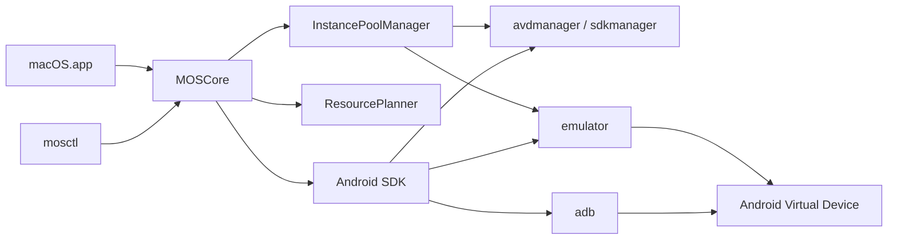

# macOS Android Emulator Architecture

## Design Boundaries

macOS Android Emulator uses Android Emulator as the execution backend. Replacing QEMU, ART, graphics virtualization, Play Services compatibility, and Android image maintenance would be a multi-year emulator engineering effort. The practical product boundary is a polished macOS platform that owns orchestration, diagnostics, instance lifecycle, APK workflows, and user experience.

## Modules

### MOSCore

`MOSCore` is the platform library.

- `AndroidSDKLocator`: finds SDK roots and produces diagnostics.
- `AVDManager`: wraps `avdmanager` and `sdkmanager`.
- `ADBManager`: wraps `adb` for devices, APK install, shell, and emulator shutdown.
- `EmulatorManager`: launches Android Emulator with runtime options.
- `InstancePoolManager`: creates and launches named AVD pools for multi-instance workflows.
- `DeviceCatalog`: stores mainstream virtual phone brand/model presets.
- `InstanceConfiguration`: stores per-instance model, display, identity, disk, root, and ADB settings.
- `MacroScript`: stores tap, swipe, wait, repeatable macro scripts as JSON.
- `StorageLayout`: moves AVD instance data to `/Volumes/DDISK/macOS/Android/avd` when DDISK is mounted.
- `ResourcePlanner`: estimates safe multi-instance capacity from host memory and runtime profile.
- `ProcessRunner`: isolates process execution for testing and future sandboxing.

### mosctl

`mosctl` is the operational CLI. It is useful for development, automation, and support.

### MOSMacApp

`MOSMacApp` is the SwiftUI shell. It consumes `MOSCore` and keeps UI state separate from emulator mechanics.

## Runtime Flow



## Why This Shape

- It is shippable on macOS without owning an Android fork.
- It can work with official images and Google APIs.
- It leaves room for a stronger custom UX like MuMu or LDPlayer while keeping the technical core maintainable.

## Multi-Instance Strategy

Each visible multi-open slot is an independent AVD by default. This avoids shared writable disk state and is safer for games and account-separated workflows. Instance names are deterministic: `prefix_01`, `prefix_02`, and so on. Ports are assigned on the Android Emulator even-port range starting at `5554`.

`ResourcePlanner` intentionally uses conservative estimates:

- Reserve at least 4 GB for macOS.
- Add emulator host overhead on top of guest RAM.
- Block `boot-pool` above the recommended max unless `--allow-overcommit` is explicit.

## Memory Strategy

The default `lean` profile is optimized for multi-open:

- 2 GB guest RAM and 2 CPU cores.
- 50 GB data partition by default, because modern games often download large secondary assets after APK install.
- Disabled audio, cameras, boot animation, metrics, and snapshot saving.
- `swiftshader_indirect` GPU mode for predictable low-footprint headless/background runs.

`balanced`, `performance`, and `game` keep the same orchestration model while raising RAM, cores, and disk allocation for heavier apps. The `game` profile uses 6 GB guest RAM, 4 CPU cores, Host GPU, and a 512 MB VM heap.

## Identity And Model Strategy

The app stores generated IMEI, IMSI, Android ID, serial, Wi-Fi MAC, phone number, model, brand, GPU, display, and disk settings in `.macos-instance.json` inside each AVD directory. Copying an instance duplicates the source AVD and rewrites this file with a randomized device profile and identity.

Official Android Emulator accepts serial, display, DPI, FPS, phone number, partition size, root/writable-system, and ADB related arguments directly. Full runtime spoofing of IMEI and read-only `ro.product.*` values requires a custom rooted image or framework-level injection, so the current implementation stores those values and exposes `inject-identity` as the bridge for writable settings and future root modules.

## App Rotation Strategy

The app stores foreground-app orientation rules in the instance configuration. A common game package such as `com.u1game.cabalm` can be marked as landscape. The monitor checks the foreground package through ADB:

- If the package matches a landscape rule, it uses the emulator hardware rotation command.
- If the package does not match, it restores portrait orientation.
- It avoids forcing `wm size 1280x720` together with `user_rotation`, because that can produce a landscape emulator frame with portrait app content inside it.

## Macro Strategy

Macro scripts are stored outside the repository under:

```text
/Volumes/DDISK/macOS/Macros
```

Each script is JSON and contains a base screen size plus ordered steps:

- `tap`
- `swipe`
- `wait`

Playback uses ADB `input tap` and `input swipe`, so it works with the official Android Emulator without private hooks. This is intentionally simple and debuggable. Future versions can add image recognition, conditional branches, and per-app key mapping.

## Game Compatibility Strategy

The default system image is Android 15 / API 35. This is current and secure, but Android 10+ restricts normal apps from reading hardware identifiers such as IMEI. Older game SDKs may behave more like commercial emulator defaults on Android 9 / API 28, so the app exposes the Android image package when creating new instances and documents the optional `system-images;android-28;google_apis;arm64-v8a` image.

Root is disabled for game compatibility by default. A rooted/writable system can help advanced injection work, but it can also trigger anti-cheat or emulator detection. The CLI supports both `--root` and `--no-root` so existing cloned instances can be moved back to game-compatible mode.

Network startup uses `-netdelay none`, `-netspeed full`, and explicit public DNS servers. The guest-side repair action also disables airplane mode and enables Wi-Fi/mobile data through ADB.

## Distribution Boundary

The repository must not include Android system images, AVD data disks, APK files, user account data, or generated build output. Users install Android SDK components themselves. This keeps the project legally and operationally cleaner for open-source publishing.
